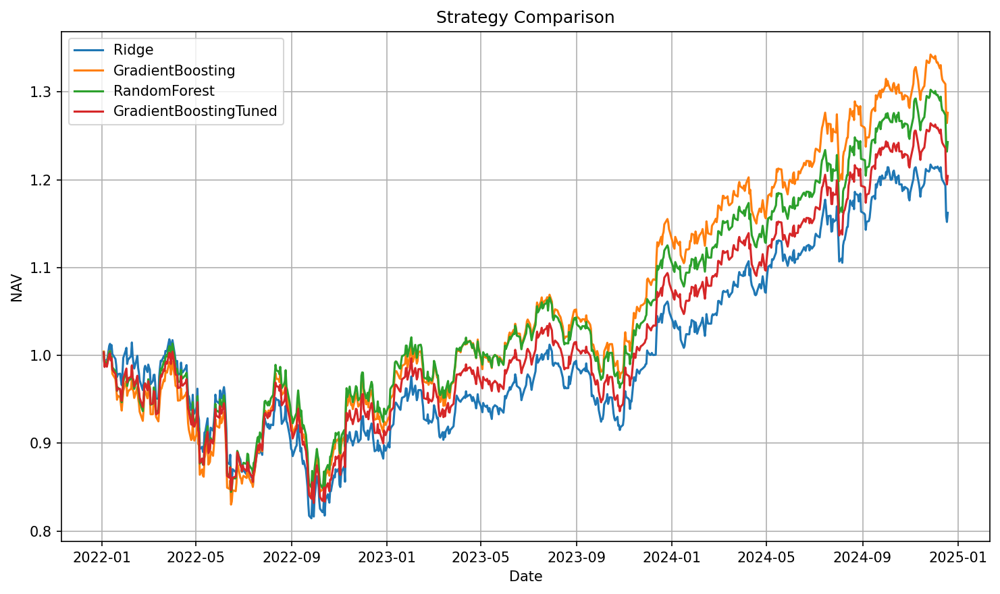

# Portfolio Model Lab

End-to-end machine learning pipeline for building and evaluating ETF portfolio strategies.

---

## Overview

This project implements a complete research workflow for:

* predicting short-horizon ETF returns
* converting predictions into portfolio allocations
* evaluating strategies using walk-forward backtesting
* comparing machine learning models against simple benchmarks

The key focus is not only predictive accuracy, but **whether models improve real investment outcomes**.

---

## Problem

In financial modeling, minimizing prediction error (e.g., MSE) does not necessarily lead to better portfolio performance.

This project investigates:

> Can machine learning models generate better risk-adjusted returns than simple allocation strategies?

---

## Approach

The pipeline consists of the following steps:

1. **Data ingestion**
   ETF price data (OHLCV) is collected and stored locally.

2. **Feature engineering**
   Backward-looking features are constructed:

   * lagged returns (1d, 5d, 20d)
   * rolling volatility
   * momentum
   * moving-average ratios
   * drawdown

3. **Target construction**
   The prediction target is the **next 5-day return** per asset.

4. **Time-based split**
   Data is split chronologically to prevent leakage.

5. **Model training**
   Multiple models are trained:

   * Ridge Regression (baseline)
   * Gradient Boosting
   * Random Forest

6. **Portfolio construction**
   Predictions are transformed into:

   * long-only weights
   * normalized allocation across assets

7. **Backtesting**

   * daily revaluation of portfolio
   * weights applied to next-day returns
   * NAV and returns tracked over time

8. **Evaluation**
   Strategies are compared using:

   * annualized return
   * volatility
   * Sharpe ratio
   * max drawdown

Benchmarks:

* Equal-weight portfolio
* Buy-and-hold SPY

---

## Results

### Model Comparison

| Model                 | Test MSE     | Return | Volatility | Sharpe   | Max Drawdown |
| --------------------- | ------------ | ------ | ---------- | -------- | ------------ |
| GradientBoosting      | 0.000750     | 8.6%   | 15.3%      | **0.56** | -17.4%       |
| RandomForest          | 0.000747     | 7.6%   | 15.2%      | 0.50     | **-16.7%**   |
| GradientBoostingTuned | 0.000742     | 6.5%   | 14.5%      | 0.45     | -17.2%       |
| Ridge                 | **0.000733** | 5.2%   | 14.9%      | 0.35     | -20.0%       |

### Benchmarks

| Strategy       | Return | Sharpe | Drawdown |
| -------------- | ------ | ------ | -------- |
| Equal Weight   | 3.6%   | 0.27   | -20.6%   |
| SPY Buy & Hold | 9.1%   | 0.52   | -24.5%   |

---

## Key Insights

### 1. Prediction accuracy ≠ portfolio performance

* Ridge achieved the **best MSE**, but the **worst investment performance**
* Gradient Boosting had worse MSE but delivered the **highest Sharpe ratio**

### 2. Model selection must be decision-driven

* Evaluating models purely on prediction metrics would lead to the wrong choice
* Portfolio-level evaluation is essential in financial ML

### 3. Hyperparameter tuning can degrade results

* Tuned Gradient Boosting improved MSE
* But **reduced Sharpe and return**
* Likely due to smoothing of predictive signals

### 4. Different models capture different risk profiles

* Gradient Boosting → best overall performance
* Random Forest → lower drawdown, more stable
* Ridge → weak signal, underperforms

### 5. ML adds value, but not always versus market baseline

* ML strategies outperform equal-weight allocation
* But do not consistently outperform SPY on return
* However, they can improve **risk-adjusted performance**

---

## Strategy Performance

The chart below shows cumulative portfolio NAV for each model.

- Gradient Boosting achieves the strongest growth
- Random Forest provides more stable performance
- Tuned Gradient Boosting underperforms the untuned version
- Ridge consistently lags behind



---

## Project Structure

```text
portfolio/
├── data/
│   ├── raw/
│   └── processed/
├── reports/
│   ├── strategy_comparison.png
│   └── model_comparison.csv
├── src/
│   └── portfolio_model_lab/
│       ├── data/
│       ├── features/
│       ├── models/
│       ├── portfolio/
│       └── backtest/
├── README.md
└── requirements.txt
```

---

## How to Run

```bash
set PYTHONPATH=src
python -m portfolio_model_lab.models.train_model
```

---

## Future Improvements

* transaction cost modeling
* turnover constraints
* risk-aware portfolio optimization (mean-variance, risk budgets)
* additional features (macro, cross-asset signals)
* model ensembling
* regime detection

---

## Final Note

This project demonstrates a key principle in applied data science:

> The best model is not the one with the lowest error — it is the one that improves the final decision outcome.

In this case, evaluating models at the portfolio level revealed insights that would be missed using traditional ML metrics alone.
